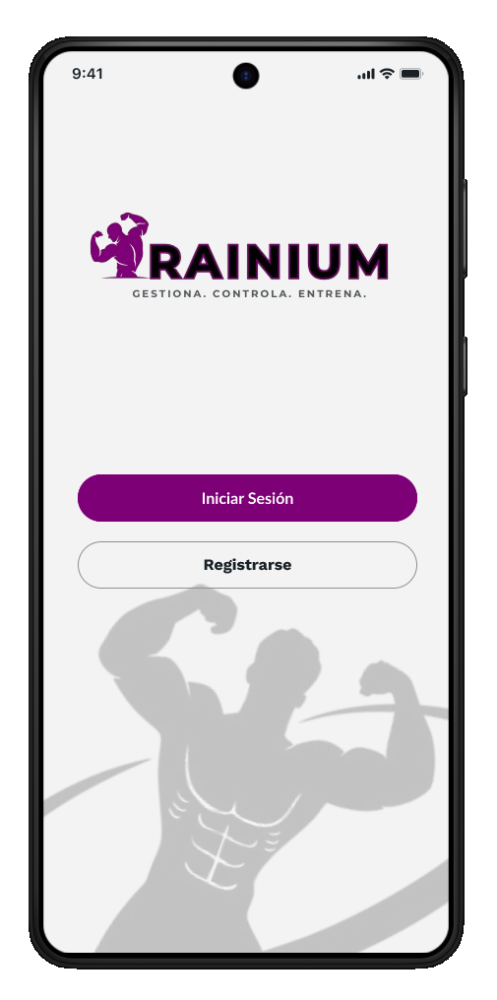
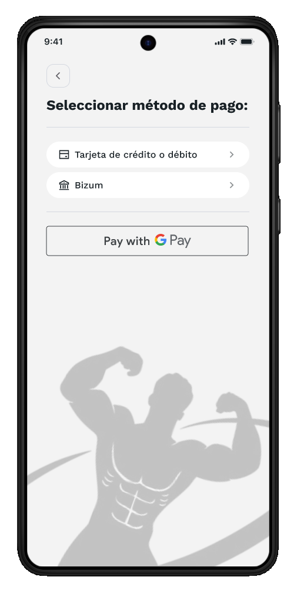

# Wireframes y flujos de navegacion

Esta sección recoge el diseño de wireframes de referencia utilizados durante el desarrollo y los flujos de usuario principales que definen la experiencia de la aplicación.

## Mapa de pantallas

La estructura de navegación de Trainium pivota sobre la **barra de navegación inferior** como elemento central de acceso a las funcionalidades principales. La línea visual de la aplicación es oscura, profesional y monocromática en azul.

## Pantallas del flujo de autenticacion

| Pantalla | Propósito | Navega hacia |
|---|---|---|
|  Autenticación | Punto de entrada. Login o acceso al registro. | Registro o Dashboard |
|  Registro | Recogida de datos iniciales del usuario (DNI, nombre, email, teléfono, contraseña). | Selección de género |
|  Selección de género | Paso de personalización del perfil. | Dashboard |

## Pantallas principales (autenticado)

| Pantalla | Propósito | Navega hacia |
|---|---|---|
|  Dashboard | Acceso rápido a reservas, seguimiento de peso y dieta. | Reserva, Registro de peso, Dietas |
|  Catálogo de máquinas | Listado y reserva de maquinaria del gimnasio. | Confirmación de reserva |
|  Seguimiento | Control de peso, gráfico de evolución, IMC y porcentaje de grasa. | Dashboard |
|  Nutrición | Plato del día con macronutrientes e ingredientes. | Dashboard |

## Flujo de suscripcion Premium

| Paso | Pantalla | Acción |
|---|---|---|
| 1 |  Planes | Selección de plan (Mensual 9,99 €, Semestral 49,99 €, Anual 89,99 €) |
| 2 |  Pago | Selección de método (Tarjeta, Bizum) |
| 3 |  Confirmación | Revisión del resumen y confirmación final |
| 4 | — | Suscripción activa. Acceso a funcionalidades Premium. |

## Flujo de reserva de maquina

| Paso | Pantalla | Acción |
|---|---|---|
| 1 | Dashboard | Pulsar "Reservar" en la categoría de ejercicio deseada |
| 2 | Catálogo de máquinas | Seleccionar la máquina específica para la sesión |
| 3 | — | Seleccionar fecha y hora mediante los diálogos de calendario y reloj |
| 4 |  Confirmación | Reserva registrada en el sistema |

## Accesibilidad y usabilidad

La interfaz aplica los siguientes criterios de diseño:

**Usabilidad:**
- Feedback inmediato mediante barras de progreso y gráficos de evolución de peso.
- Barra de navegación inferior fija y predecible que reduce la curva de aprendizaje.
- Agrupamiento de información en tarjetas con encabezados claros para facilitar el escaneo visual.
- Acceso rápido a las funciones más usadas desde el Dashboard.

**Accesibilidad:**
- Contraste de color alto: texto blanco sobre fondos oscuros en el tema oscuro, texto azul oscuro sobre fondos claros en el tema claro.
- Elementos táctiles de tamaño generoso (mínimo 48 dp) y bien espaciados.
- Etiquetas y placeholders descriptivos en todos los campos de formulario.
- Indicadores visuales de estado con leyenda textual (no solo color).
