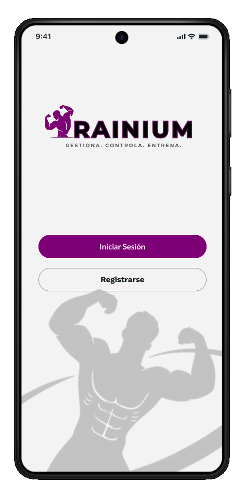

# Wireframe: Pantalla de Inicio de Sesión



## 🎯 Objetivo
Proporcionar un acceso seguro y intuitivo al sistema Rainium.

## 📱 Componentes de Interfaz

### Header
- **Reloj**: 9:41 (indicador de hora del sistema)
- **Logo**: RAINIUM (branding principal)
- **Eslogan**: "GESTIONA.CONTROLA.ENTRENA." (value proposition)

### Cuerpo Principal
- **Botón "Iniciar Sesión"** - Acceso para usuarios existentes
- **Botón "Registrarse"** - Onboarding para nuevos usuarios

## 🎨 Características de Diseño
- **Minimalista**: Solo elementos esenciales
- **Claridad visual**: Contraste adecuado
- **Call-to-action prominente**

## 🔧 Especificaciones Técnicas
```css
.auth-container {
  background: linear-gradient(135deg, #71006c 0%, #4a0047 100%);
  color: white;
  text-align: center;
  padding: 2rem;
}

.cta-buttons {
  display: flex;
  flex-direction: column;
  gap: 1rem;
  margin-top: 2rem;
}