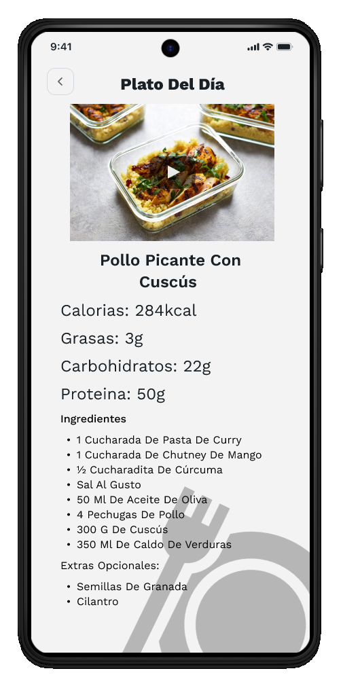

# 🗺️ Mapa de Pantallas y Navegación

El diseño de la aplicación "TRAINIUM" se basa en una estructura clara con la **Barra de Navegación Inferior** como elemento central para la transición entre las principales funcionalidades.

## Estructura y Vínculos Principales

| Pantalla (Wireframe) | Propósito Principal | Navegación desde | Navegación hacia |
| :--- | :--- | :--- | :--- |
|  | **Autenticación (Login/Registro)**. Punto de entrada de la aplicación. | Inicio de la aplicación. | Registro o Pantalla pricipal
|  | **Formulario de Registro**. Recolección de datos iniciales del usuario (peso, altura, DNI). | Registro | Seleccion de género
|  | **Selección de Género**. Paso de personalización inicial del perfil. | Selección de género | Pantalla pricipal |
|  | **Inicio (Home/Dashboard)**. Acceso rápido a reservas, seguimiento de peso y dieta. | Login/Register | Reserva / Retos de peso / Dietas
|  | **Reservar / Seleccionar Ejercicio**. Categorización para la reserva de máquinas específicas. | Barra de navegación / Pantalla principal | Selección de maquina
|  | **Seleccionar ejercicio especifico**. Reserva una maquina especificamente para el entrenamiento necesario | Reservar / Seleccionar Ejercicio | Inicio
|  | **Perfil / Seguimiento**. Muestra el control de peso (gráfico), IMC y porcentaje de grasa. | Barra de navegación / Pantalla principal | Inicio
|  | **Planes de dieta**. Receta, macronutrientes e ingredientes del "Plato del Día".| Pantalla Pricipal / Perfil usuario | Atrás |
|  | **Suscripción Premium**. Presentación de beneficios y selección de plan (Mensual/Anual). | Barra de navegación inferior ("Premium"). | Pago |
|  | **Seleccionar Método de Pago**. Opciones de pago (Tarjeta, Bizum, G Pay). | Subscripción Premium | Confirmación de pago |
|  | **Detalle de Pago (Google Pay)**. Modal de confirmación final de la transacción. | Opciones de pago | Pasarela de pago |

## 🧭 Barra de Navegación Inferior (Global)

La barra de navegación es un componente constante que asegura un acceso rápido a las funciones principales:

* **Inicio**
* **Reservar**
* **Premium**
* **Perfil**