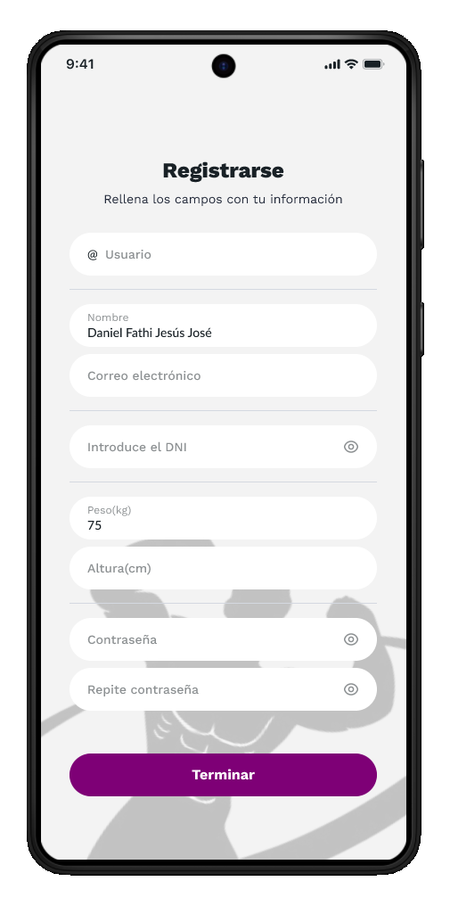
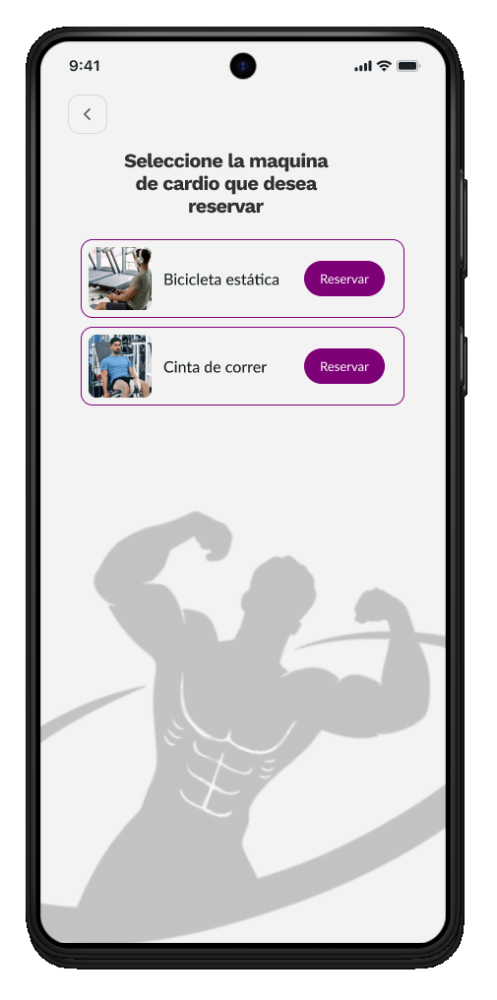

# 🚀 Flujos de Usuario Principales

Se definen tres flujos críticos que cubren el ciclo de vida inicial del usuario en la aplicación: el registro, la interacción principal (reserva) y la monetización (suscripción).

## 1. Flujo de Registro y Onboarding

Este flujo captura la información inicial necesaria para personalizar la experiencia del usuario.

| Paso | Pantalla (Wireframe) | Acción del Usuario | Resultado |
| :--- | :--- | :--- | :--- |
| **1. Inicio** |  | Pulsa **"Registrarse"**. | Acceso al formulario de datos. |
| **2. Datos Personales** |  | Rellena todos los campos (Peso, Altura, DNI, Contraseña) y pulsa **"Terminar"**. | Se recopilan métricas iniciales del usuario. |
| **3. Selección de Género** |  | Selecciona el género (Hombre/Mujer) y pulsa **"Continuar"**. | Se finaliza la personalización básica del perfil. |
| **4. Dashboard** |  | El usuario es dirigido a la pantalla de Inicio. | El usuario ya puede interactuar con la aplicación. |

## 2. Flujo de Reserva de Máquina Rápida

Este flujo permite al usuario reservar una categoría de ejercicio directamente desde el Dashboard.

| Paso | Pantalla (Wireframe) | Acción del Usuario | Resultado |
| :--- | :--- | :--- | :--- |
| **1. Dashboard** |  | Pulsa el botón **"Reservar"** junto al tipo de ejercicio deseado (ej. Cardio). | Se inicia el proceso de reserva para esa categoría. |
| **2. Selección de Ejercicio**|  | Confirma o selecciona otro tipo de ejercicio (Espalda, Pierna, Pecho, etc.). | Se selecciona la categoría para buscar disponibilidad. |
| **3. Aviso** |  | Lee la advertencia: "Las actividades con mancuernas o bancos no es posible hacer una reserva". | **Guardrail:** Se informa sobre las limitaciones del sistema de reserva. |
| **4. Continuación** | (Pantalla no incluida) | (Continuación de la selección de máquina y horario). | Reserva completada. |

## 3. Flujo de Suscripción Premium y Pago

Este flujo es el proceso de conversión de usuario gratuito a suscriptor Premium.

| Paso | Pantalla (Wireframe) | Acción del Usuario | Resultado |
| :--- | :--- | :--- | :--- |
| **1. Promoción** |  | Selecciona el plan (Mensual: **6,99€** o Anual: **69,90€**) y pulsa **"Desbloquea las ventajas"**. | Se confirman los beneficios y el precio. |
| **2. Métodos de Pago**|  | Selecciona una opción (Tarjeta, Bizum, o pulsa **"Pay with G Pay"**). | Se inicia el proceso con el proveedor de pago. |
| **3. Confirmación G Pay**|  | Se revisa el resumen del pago en el *bottom sheet* y pulsa **"Continuar y pagar"**. | Se autoriza la transacción. |
| **4. Finalización** | No implementado aún | (Recibe confirmación de suscripción activa). | Acceso a funcionalidades Premium (Reserva anticipada, Prioridad). |