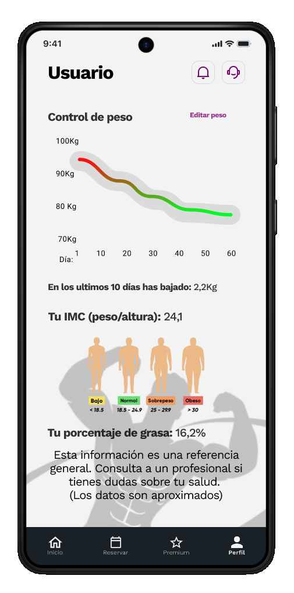
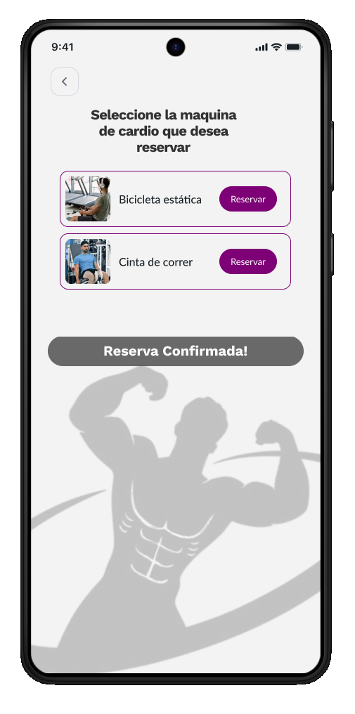

# الإطارات السلكية وتدفقات التنقل

يجمع هذا القسم تصميم الإطارات السلكية المرجعية المستخدمة أثناء التطوير وتدفقات المستخدم الرئيسية التي تحدد تجربة التطبيق.

## خريطة الشاشة

تدور بنية التنقل الخاصة بـ Trainium حول **شريط التنقل السفلي** باعتباره العنصر المركزي للوصول إلى الوظائف الرئيسية. الخط المرئي للتطبيق داكن واحترافي وأحادي اللون باللون الأزرق.

## شاشات تدفق المصادقة

| شاشة | الغرض | انتقل إلى | 
|---|---|---| 
|  التوثيق | نقطة الدخول. تسجيل الدخول أو الوصول إلى التسجيل. | التسجيل أو لوحة القيادة | 
|  التسجيل | جمع بيانات المستخدم الأولية (الهوية، الاسم، البريد الإلكتروني، الهاتف، كلمة المرور). | اختيار الجنس | 
|  اختيار الجنس | خطوة تخصيص الملف الشخصي. | لوحة القيادة |

## الشاشات الرئيسية (مصادق عليها)

| شاشة | الغرض | انتقل إلى | 
|---|---|---| 
|  لوحة التحكم | الوصول السريع إلى الحجوزات والوزن وتتبع النظام الغذائي. | الاحتياطي، سجل الوزن، الوجبات الغذائية | 
|  كتالوج الماكينات | قائمة وحجز الآلات الرياضية. | تأكيد الحجز | 
|  تتبع | التحكم في الوزن، الرسم البياني للتطور، مؤشر كتلة الجسم ونسبة الدهون. | لوحة القيادة | 
|  التغذية | طبق اليوم مع العناصر الغذائية الكبيرة والمكونات. | لوحة القيادة |

## تدفق الاشتراكات المميزة

| خطوة | شاشة | العمل | 
|---|---|---| 
| 1 |  الخطط | اختيار الخطة (شهريًا 9.99 يورو، نصف سنوي 49.99 يورو، سنوي 89.99 يورو) | 
| 2 |  الدفع | طريقة اختيار (بطاقة، بيزوم) | 
| 3 |  التأكيد | مراجعة موجزة وتأكيد نهائي | 
| 4 | — | الاشتراك النشط. الوصول إلى الميزات المميزة. |

## التدفق الاحتياطي للآلة

| خطوة | شاشة | العمل | 
|---|---|---| 
| 1 | لوحة القيادة | اضغط على "حجز" في فئة التمرين المطلوب | 
| 2 | كتالوج الآلة | حدد الجهاز المحدد للجلسة | 
| 3 | — | حدد التاريخ والوقت باستخدام مربعات حوار التقويم والساعة | 
| 4 |  التأكيد | الحجز مسجل في النظام |

## إمكانية الوصول وسهولة الاستخدام

تطبق الواجهة معايير التصميم التالية:

**سهولة الاستخدام:**
- تعليقات فورية من خلال أشرطة التقدم والرسوم البيانية لتطور الوزن. 
- شريط تنقل سفلي ثابت ويمكن التنبؤ به مما يقلل من منحنى التعلم. 
- تجميع المعلومات في بطاقات ذات عناوين واضحة لسهولة المسح البصري. 
- الوصول السريع إلى الوظائف الأكثر استخدامًا من لوحة المعلومات.

**إمكانية الوصول:**
- تباين ألوان عالي: نص أبيض على خلفيات داكنة في المظهر الداكن، ونص أزرق داكن على الخلفيات الفاتحة في المظهر الفاتح. 
- عناصر ملموسة ذات حجم كبير (الحد الأدنى 48 dp) ومتباعدة بشكل جيد. 
- التسميات الوصفية والعناصر النائبة في جميع حقول النموذج. 
- مؤشرات الحالة المرئية مع وسيلة الإيضاح النصية (وليس اللون فقط).