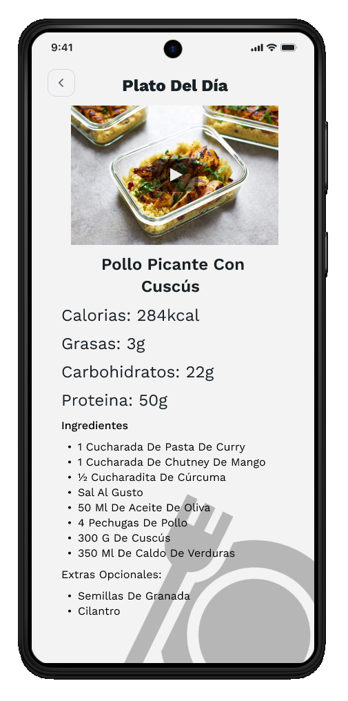

# Wireframes i fluxos de navegació

Aquesta secció recull el disseny de wireframes de referència utilitzats durant el desenvolupament i els fluxos dusuari principals que defineixen lexperiència de laplicació.

## Mapa de pantalles

L'estructura de navegació de Trainium pivota sobre la barra de navegació inferior com a element central d'accés a les funcionalitats principals. La línia visual de laplicació és fosca, professional i monocromàtica en blau.

## Pantalles del flux d'autenticació

| Pantalla | Propòsit | Navega cap a | 
|---|---|---| 
|  Autenticació | Punt dentrada. Login o accés al registre. | Registre o Dashboard | 
|  Registre | Recollida de dades inicials de l'usuari (DNI, nom, correu electrònic, telèfon, contrasenya). | Selecció de gènere | 
|  Selecció de gènere | Pas de personalització del perfil. | Dashboard |

## Pantalles principals (autenticat)

| Pantalla | Propòsit | Navega cap a | 
|---|---|---| 
|  Dashboard | Accés ràpid a reserves, seguiment de pes i dieta. | Reserva, Registre de pes, Dietes | 
|  Catàleg de màquines | Llistat i reserva de maquinària del gimnàs. | Confirmació de reserva | 
|  Seguiment | Control de pes, gràfic devolució, IMC i percentatge de greix. | Dashboard | 
|  Nutrició | Plat del dia amb macronutrients i ingredients. | Dashboard |

## Flux de subscripció Premium

| Pas | Pantalla | Acció | 
|---|---|---| 
| 1 |  Plans | Selecció de pla (Mensual 9,99 €, Semestral 49,99 €, Anual 89,99 €) | 
| 2 |  Pagament | Selecció de mètode (Targeta, Bizum) | 
| 3 |  Confirmació | Revisió del resum i confirmació final | 
| 4 | — | Subscripció activa. Accés a funcionalitats Premium. |

## Flux de reserva de màquina

| Pas | Pantalla | Acció | 
|---|---|---| 
| 1 | Dashboard | Cliqueu "Reservar" a la categoria d'exercici desitjada | 
| 2 | Catàleg de màquines | Seleccionar la màquina específica per a la sessió | 
| 3 | — | Seleccionar data i hora mitjançant els diàlegs de calendari i rellotge | 
| 4 |  Confirmació | Reserva registrada al sistema |

## Accessibilitat i usabilitat

La interfície aplica els següents criteris de disseny:

**Usabilitat:** 
- Feedback immediat mitjançant barres de progrés i gràfics devolució de pes. 
- Barra de navegació inferior fixa i predictible que redueix la corba daprenentatge. 
- Agrupament dinformació en targetes amb encapçalaments clars per facilitar lescaneig visual. 
- Accés ràpid a les funcions més utilitzades des del Dashboard.

**Accessibilitat:** 
- Contrast de color alt: text blanc sobre fons foscos al tema fosc, text blau fosc sobre fons clars al tema clar. 
- Elements tàctils de mida generosa (mínim 48 dp) i ben espaiats. 
- Etiquetes i placeholders descriptius a tots els camps de formulari. 
- Indicadors visuals d'estat amb llegenda textual (no només color).