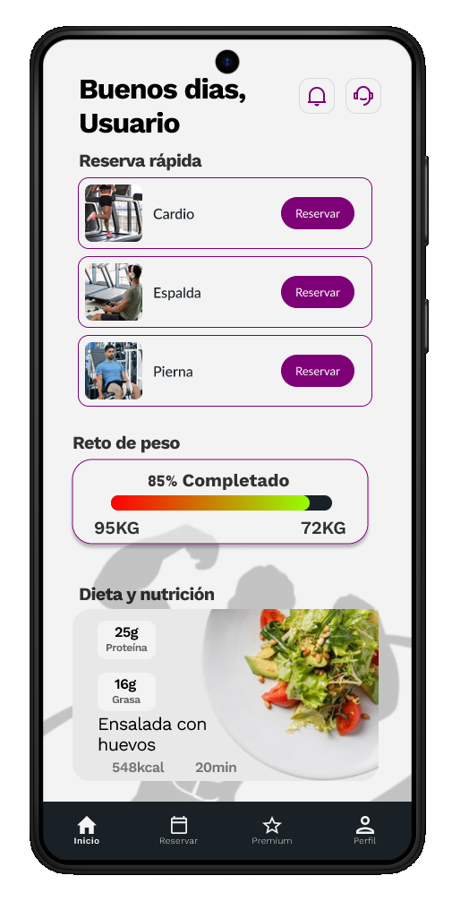

# Wireframes eta nabigazio-fluxuak

Atal honek garapenean erabilitako erreferentzia-wireframeen diseinua eta aplikazioaren esperientzia definitzen duten erabiltzaile-fluxu nagusiak biltzen ditu.

## Pantaila-mapa

Trainium-en nabigazio-egitura **beheko nabigazio-barran** pibotatzen da, funtzionalitate nagusietara sartzeko elementu nagusi gisa. Aplikazioaren lerro bisuala iluna, profesionala eta monokromatikoa da urdinez.

## Autentifikazio-fluxuaren pantailak

| Pantaila | Helburua | Nabigatu | 
|---|---|---| 
|  Autentifikazioa | Sarrera puntua. Hasi saioa edo sartu erregistroan. | Erregistroa edo Arbel | 
|  Izen-ematea | Hasierako erabiltzailearen datuen bilketa (NAN, izena, posta elektronikoa, telefonoa, pasahitza). | Genero hautaketa | 
|  Genero aukeraketa | Profila pertsonalizatzeko urratsa. | Arbel |

## Pantaila nagusiak (autentifikatuak)

| Pantaila | Helburua | Nabigatu | 
|---|---|---| 
|  Arbel | Sarbide azkarra erreserbak, pisua eta dietaren jarraipena. | Erreserba, Pisu-erregistroa, Dietak | 
|  Makinen katalogoa | Gimnasioko makinen zerrenda eta erreserba. | Erreserbaren berrespena | 
|  Jarraipena | Pisuaren kontrola, bilakaera grafikoa, GMI eta gantz ehunekoa. | Arbel | 
|  Elikadura | Eguneko platera makronutrienteekin eta osagaiekin. | Arbel |

## Premium subion fluxua

| Urratsa | Pantaila | Ekintza | 
|---|---|---| 
| 1 |  Planoak | Planaren hautaketa (Hileroko 9,99 €, Semestral 49,99 €, Urteko 89,99 €) | 
| 2 |  Ordainketa | Metodoa hautatzea (Txartela, Bizum) | 
| 3 |  Berrespena | Laburpena berrikuspena eta azken berrespena | 
| 4 | — | Harpidetza aktiboa. Premium eginbideetarako sarbidea. |

## Makinen erreserba-fluxua

| Urratsera | Pantaila | Ekintza | 
|---|---|---| 
| 1 | Arbel | Sakatu "Liburu" nahi duzun ariketa kategorian | 
| 2 | Makinen katalogoa | Hautatu saiorako makina zehatza | 
| 3 | — | Hautatu data eta ordua egutegiaren eta erlojuaren elkarrizketa-koadroak erabiliz | 
| 4 |  Berrespena | Sisteman erregistratutako erreserba |

## Irisgarritasuna eta erabilgarritasuna

Interfazeak diseinu irizpide hauek aplikatzen ditu:

**Erabilgarritasuna:**
- Berehalako iritzia aurrerapen-barren eta pisuaren bilakaeraren grafikoen bidez. 
- Beheko nabigazio-barra finkoa eta aurreikusgarria, ikasketa kurba murrizten duena. 
- Informazioa goiburu argiak dituzten txarteletan taldekatzea bisual eskaneatu errazteko. 
- Sarbide azkarra Arbeletik gehien erabiltzen diren funtzioetara.

**Irisgarritasuna:**
- Kolore kontraste handia: testu zuria atzeko plano ilunean gai ilunean, testu urdin iluna hondo argietan gai argian. 
- Tamaina eskuzabaleko ukimen-elementuak (gutxienez 48 dp) eta ondo banatuta. 
- Etiketa deskribatzaileak eta leku-markak inprimaki-eremu guztietan. 
- Egoera-adierazle bisualak testu-legendarekin (ez bakarrik kolorea).