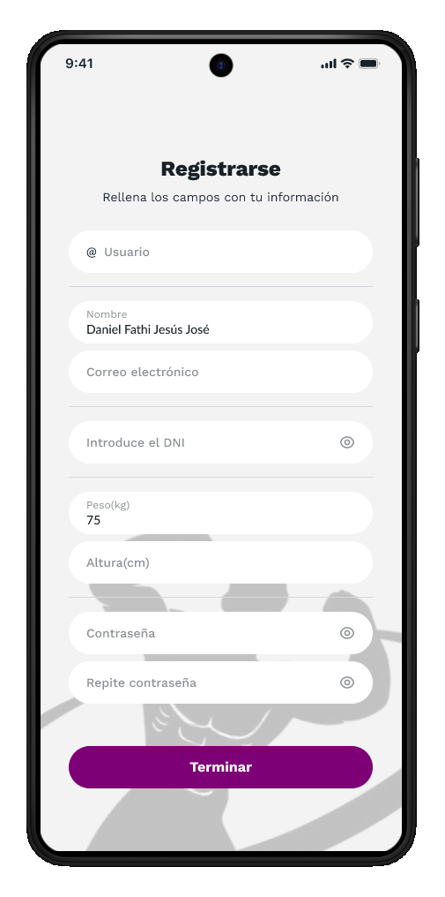

# Wireframes e fluxos de navegación

Esta sección recolle o deseño dos wireframes de referencia utilizados durante o desenvolvemento e os principais fluxos de usuarios que definen a experiencia da aplicación.

## Mapa da pantalla

A estrutura de navegación de Trainium pivota na **barra de navegación inferior** como elemento central para acceder ás principais funcionalidades. A liña visual da aplicación é escura, profesional e monocromática en azul.

## Pantallas de fluxo de autenticación

| Pantalla | Finalidade | Navega ata | 
|---|---|---| 
|  Autenticación | Punto de entrada. Iniciar sesión ou acceder ao rexistro. | Rexistro ou Panel | 
|  Rexistro | Recollida dos datos iniciais do usuario (DNI, nome, correo electrónico, teléfono, contrasinal). | Selección de xénero | 
|  Selección de xénero | Paso de personalización do perfil. | Panel de control |

## Pantallas principais (autenticadas)

| Pantalla | Finalidade | Navega ata | 
|---|---|---| 
|  Panel de control | Acceso rápido ás reservas, ao seguimento do peso e da dieta. | Reserva, rexistro de peso, dietas | 
|  Catálogo de máquinas | Listaxe e reserva de maquinaria de ximnasio. | Confirmación da reserva | 
|  Seguimento | Control de peso, gráfico de evolución, IMC e porcentaxe de graxa. | Panel de control | 
|  Nutrición | Prato do día con macronutrientes e ingredientes. | Panel de control |

## Fluxo de subión premium

| Paso | Pantalla | Acción | 
|---|---|---| 
| 1 |  Plans | Selección do plan (Mensual 9,99 €, Semestral 49,99 €, Anual 89,99 €) | 
| 2 |  Pago | Selección do método (Tarxeta, Bizum) | 
| 3 |  Confirmación | Revisión resumida e confirmación final | 
| 4 | — | Subscrición activa. Acceso ás funcións Premium. |

## Fluxo de reserva da máquina

| Paso | Pantalla | Acción | 
|---|---|---| 
| 1 | Panel de control | Prema "Libro" na categoría de exercicios desexada | 
| 2 | Catálogo de máquinas | Seleccione a máquina específica para a sesión | 
| 3 | — | Seleccione a data e a hora mediante os diálogos do calendario e do reloxo | 
| 4 |  Confirmación | Reserva rexistrada no sistema |

## Accesibilidade e usabilidade

A interface aplica os seguintes criterios de deseño:

**Usabilidade:**
- Retroalimentación inmediata mediante barras de progreso e gráficos de evolución do peso. 
- Barra de navegación inferior fixa e previsible que reduce a curva de aprendizaxe. 
- Agrupación de información en tarxetas con títulos claros para facilitar a exploración visual. 
- Acceso rápido ás funcións máis utilizadas desde o Panel.

**Accesibilidade:**
- Alto contraste de cores: texto branco sobre fondos escuros no tema escuro, texto azul escuro sobre fondos claros no tema claro. 
- Elementos táctiles de tamaño xeneroso (mínimo 48 dp) e ben espazados. 
- Etiquetas descritivas e marcadores de posición en todos os campos do formulario. 
- Indicadores visuais de estado con lenda textual (non só cor).