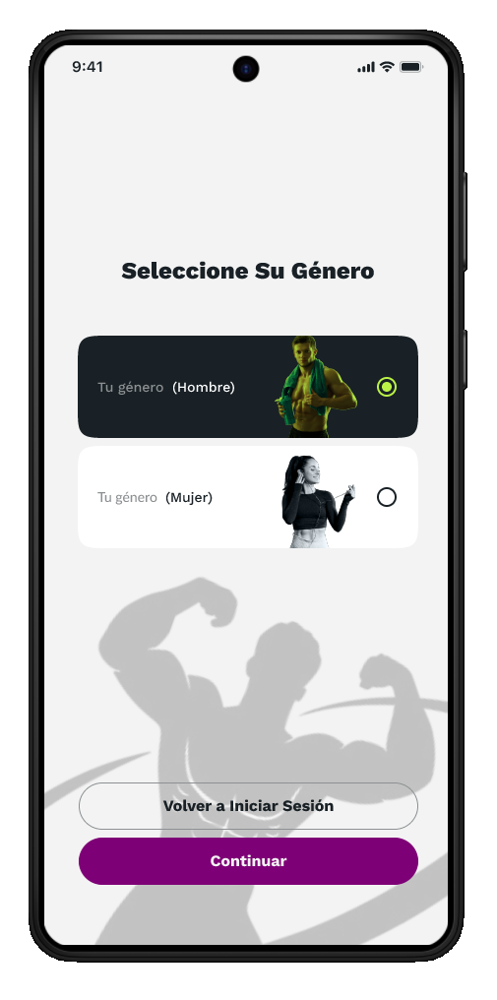
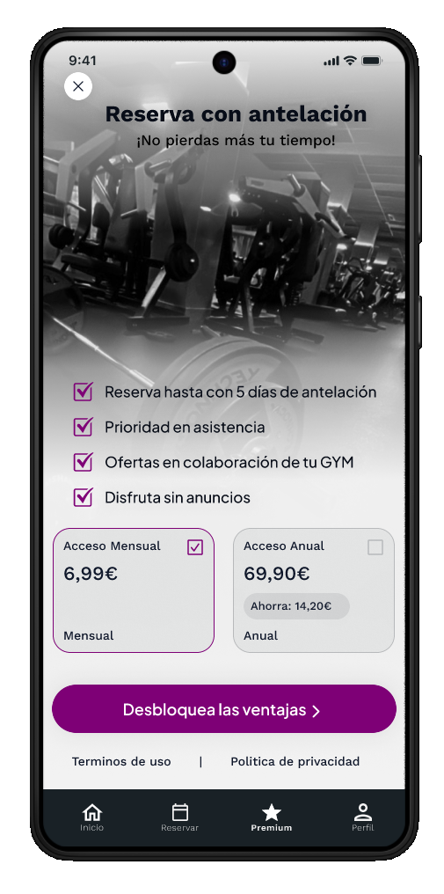

# Wireframes e fluxos de navegação

Esta seção coleta o design de wireframes de referência usados ​​durante o desenvolvimento e os principais fluxos de usuário que definem a experiência do aplicativo.

## Mapa da tela

A estrutura de navegação do Trainium gira na **barra de navegação inferior** como elemento central para acessar as principais funcionalidades. A linha visual do aplicativo é escura, profissional e monocromática em azul.

## Telas de fluxo de autenticação

| Tela | Finalidade | Navegue até | 
|---|---|---| 
|  Autenticação | Ponto de entrada. Faça login ou acesse o registro. | Cadastro ou Dashboard | 
|  Cadastro | Recolha de dados iniciais do utilizador (ID, nome, email, telefone, palavra-passe). | Seleção de gênero | 
|  Seleção de gênero | Etapa de personalização do perfil. | Painel |

## Telas principais (autenticadas)

| Tela | Finalidade | Navegue até | 
|---|---|---| 
|  Painel | Acesso rápido a reservas, monitoramento de peso e dieta. | Reserva, Registro de peso, Dietas | 
|  Catálogo de máquinas | Lista e reserva de máquinas de ginástica. | Confirmação de reserva | 
|  Rastreamento | Controle de peso, gráfico de evolução, IMC e percentual de gordura. | Painel | 
|  Nutrição | Prato do dia com macronutrientes e ingredientes. | Painel |

## Fluxo de assinatura premium

| Etapa | Tela | Ação | 
|---|---|---| 
| 1 |  Planos | Seleção do plano (Mensal 9,99€, Semestral 49,99€, Anual 89,99€) | 
| 2 |  Pagamento | Seleção de métodos (Card, Bizum) | 
| 3 |  Confirmação | Revisão resumida e confirmação final | 
| 4 | — | Assinatura ativa. Acesso a recursos Premium. |

## Fluxo de reserva de máquina

| Etapa | Tela | Ação | 
|---|---|---| 
| 1 | Painel | Pressione “Reservar” na categoria de exercício desejada | 
| 2 | Catálogo de máquinas | Selecione a máquina específica para a sessão | 
| 3 | — | Selecione data e hora usando caixas de diálogo de calendário e relógio | 
| 4 |  Confirmação | Reserva cadastrada no sistema |

## Acessibilidade e usabilidade

A interface aplica os seguintes critérios de design:

**Usabilidade:**
- Feedback imediato através de barras de progresso e gráficos de evolução de peso. 
- Barra de navegação inferior fixa e previsível que reduz a curva de aprendizado. 
- Agrupamento de informações em cartões com títulos claros para fácil digitalização visual. 
- Acesso rápido às funções mais utilizadas do Dashboard.

**Acessibilidade:**
- Alto contraste de cores: texto branco em fundos escuros no tema escuro, texto em azul escuro em fundos claros no tema claro. 
- Elementos táteis de tamanho generoso (mínimo 48 dp) e bem espaçados. 
- Etiquetas descritivas e espaços reservados em todos os campos do formulário. 
- Indicadores visuais de status com legenda textual (não apenas colorida).