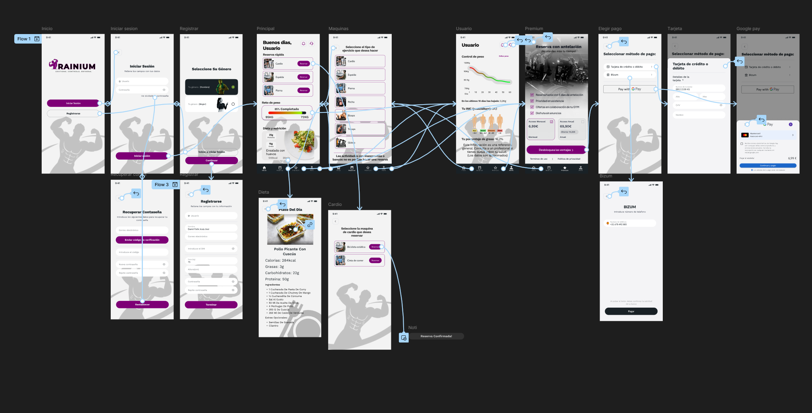
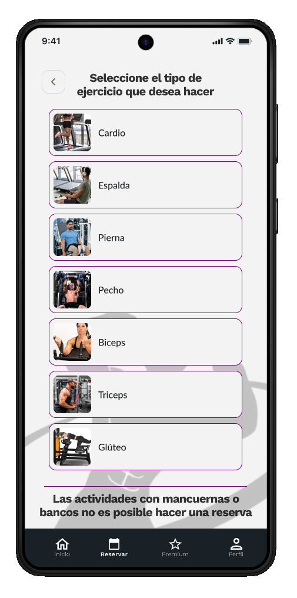

# Каркасы и потоки навигации

В этом разделе собраны образцы эталонных каркасов, использованных во время разработки, а также основные пользовательские потоки, определяющие работу приложения.

## Карта экрана

В структуре навигации Trainium используется **нижняя панель навигации**, являющаяся центральным элементом доступа к основным функциям. Визуальная линия приложения темная, профессиональная и монохромная в синем цвете.

## Экраны потока аутентификации

| Экран | Цель | Перейдите к | 
|---|---|---| 
|  Аутентификация | Точка входа. Войти или получить доступ к реестру. | Регистрация или личный кабинет | 
|  Регистрация | Сбор исходных данных пользователя (ID, имя, адрес электронной почты, телефон, пароль). | Выбор пола | 
|  Выбор пола | Этап настройки профиля. | Панель управления |

## Главные экраны (аутентифицированные)

| Экран | Цель | Перейдите к | 
|---|---|---| 
|  Панель управления | Быстрый доступ к резервированию, отслеживанию веса и диеты. | Резерв, Рекорд веса, Диеты | 
|  Каталог станков | Список и бронирование тренажеров. | Подтверждение бронирования | 
|  Отслеживание | Контроль веса, график эволюции, ИМТ и процент жира. | Панель управления | 
|  Питание | Блюдо дня с макронутриентами и ингредиентами. | Панель управления |

## Поток премиум-субтионов

| Шаг | Экран | Действие | 
|---|---|---| 
| 1 |  Планы | Выбор плана (9,99 евро в месяц, 49,99 евро в полугодовой период, 89,99 евро в год) | 
| 2 |  Оплата | Метод выбора (Карта, Бизум) | 
| 3 |  Подтверждение | Сводная проверка и окончательное подтверждение | 
| 4 | — | Активная подписка. Доступ к премиум-функциям. |

## Резервный поток машины

| Шаг | Экран | Действие | 
|---|---|---| 
| 1 | Панель управления | Нажмите «Забронировать» на нужной категории упражнений | 
| 2 | Каталог машин | Выберите конкретную машину для сеанса | 
| 3 | — | Выберите дату и время с помощью диалоговых окон календаря и часов | 
| 4 |  Подтверждение | Бронирование зарегистрировано в системе |

## Доступность и удобство использования

Интерфейс применяет следующие критерии проектирования:

**Удобство использования:**
- Немедленная обратная связь через индикаторы выполнения и графики изменения веса. 
- Исправлена ​​и предсказуемая нижняя панель навигации, которая сокращает время обучения. 
- Группировка информации в карточки с четкими заголовками для удобства визуального сканирования. 
- Быстрый доступ к наиболее часто используемым функциям с панели управления.

**Доступность:**
- Высокая цветовая контрастность: белый текст на темном фоне в темной теме, темно-синий текст на светлом фоне в светлой теме. 
- Тактильные элементы большого размера (минимум 48 dp) и хорошо расположены. 
- Описательные метки и заполнители во всех полях формы. 
- Визуальные индикаторы состояния с текстовой легендой (не только цветом).